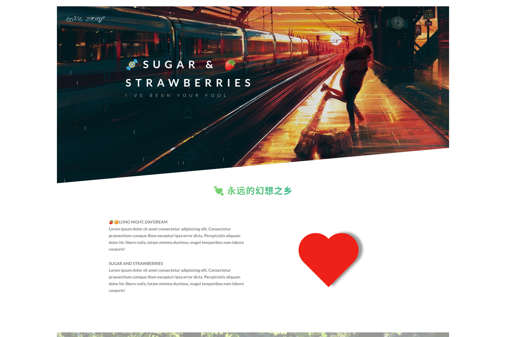

<div align="center">
  <a href="https://qsomula.top">
    
  </a>
  <h1 align="center">
    🍬SUGAR & 🍓STRAWBERRIES
  </h1>
  <h3 align="center">
    <a href="https://qsomula.top">扣个小心心送给你</a>
  </h3>

[](https://github.com/Harris-Shelby/SUGAR__STRAWBERRIES-SUGAR__AND__STRAWBERRIES/releases)  [](https://github.com/Harris-Shelby/SUGAR__STRAWBERRIES-SUGAR__AND__STRAWBERRIES/blob/master/LICENSE)  [](https://github.com/Harris-Shelby/SUGAR__STRAWBERRIES-SUGAR__AND__STRAWBERRIES/commits)  [](https://drone.qsomula.top/SUGAR__STRAWBERRIES/SUGAR__AND__STRAWBERRIES)



</div>

**Introduction**
  
Hi there, this project is built with HTML and Sass😜. My original intention to create this project is to build some amazing animation effects with the simple language(Sass) ,not with javascript.I hope to finish it someday in the future. So keep going✊！

**Task lists**

- [X] 🌈 CSS animation of Dripping rain~~
- [X] 💓 CSS animation of Beating heart~~
- [X] 🌎 Responsive design ... Although it is still bad~~
- [X] 🌱 HTTP/2~~
- [ ] 🎶 Background music player
- [ ] 🎈 The component of Confession balloon 

In the future, i will surely final the goal above.

**Development**

```bash
git clone git@github.com:Harris-Shelby/SUGAR__AND__STRAWBERRIES.git
cd SUGAR__AND__STRAWBERRIES
npm i
npm run compile:dev
npm run start
```
Don't forget to configure the [```package.json ```](https://github.com/Harris-Shelby/SUGAR__AND__STRAWBERRIES/blob/master/package.json),
I hope you guys enjoy it😘 ~

**License**

[MIT](https://github.com/Harris-Shelby/SUGAR__AND__STRAWBERRIES/blob/master/LICENSE). Copyright (c) 2020 Harris Shelby &hearts;穿堂风 &reg;